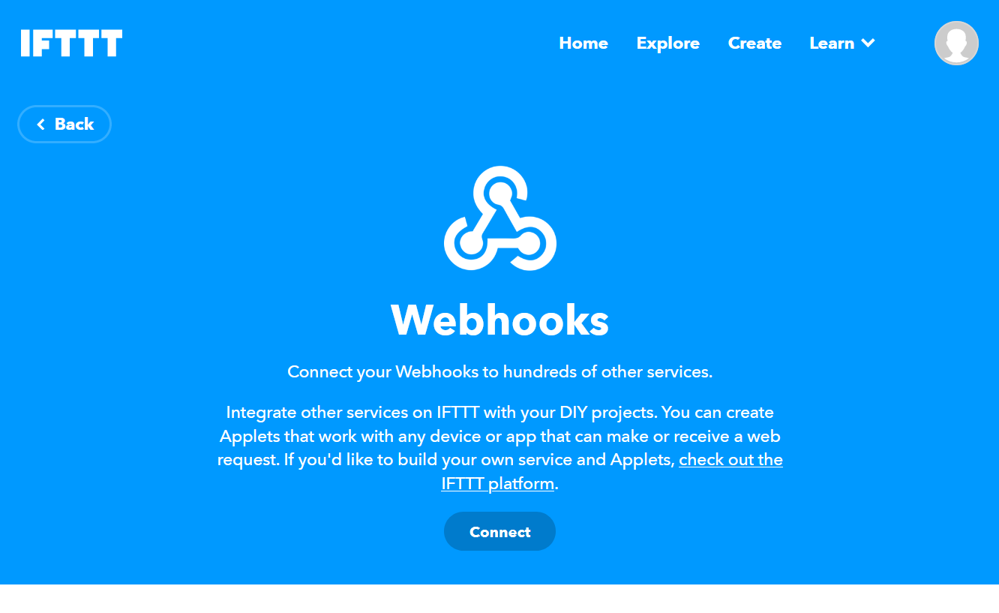
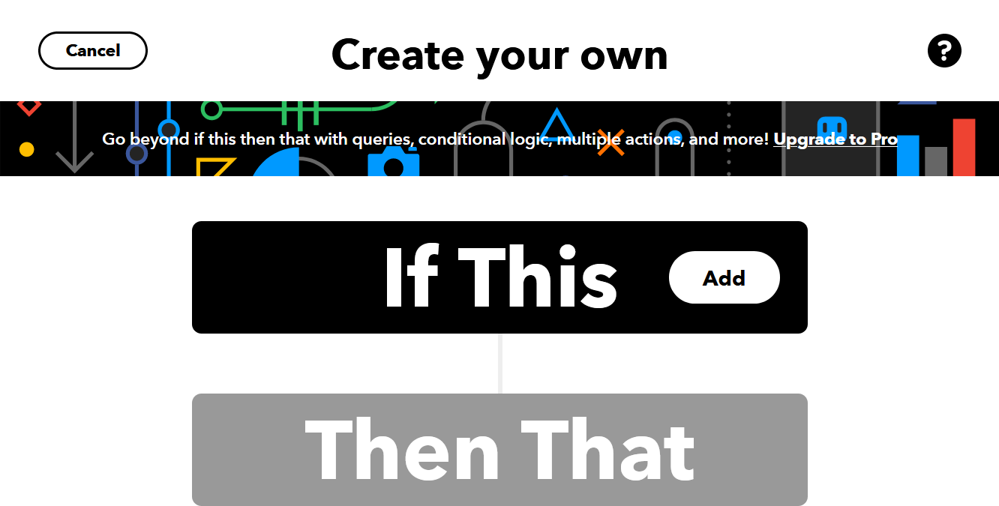
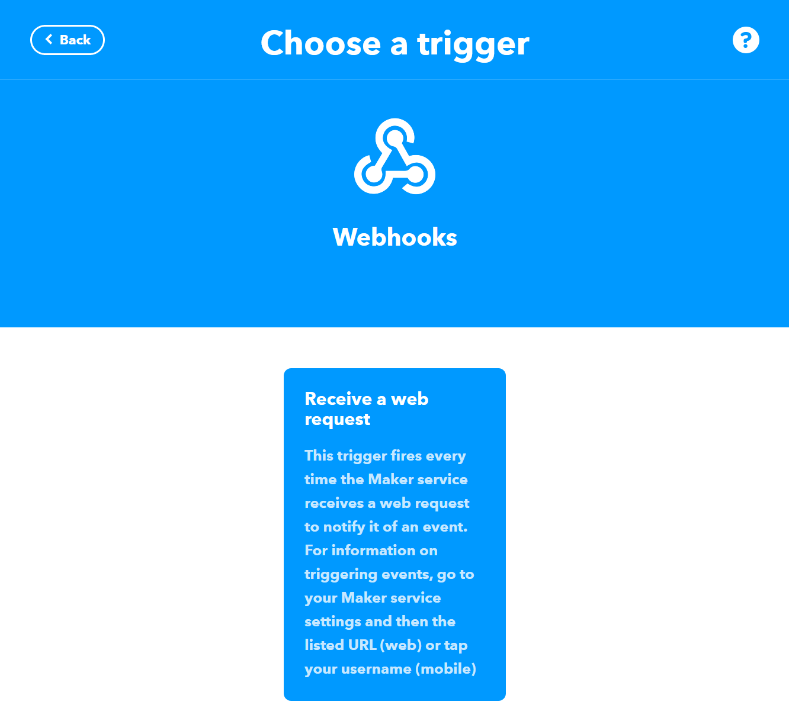
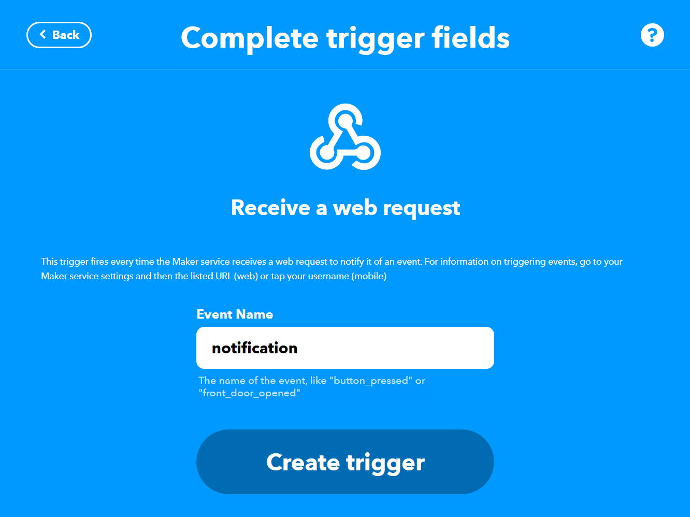
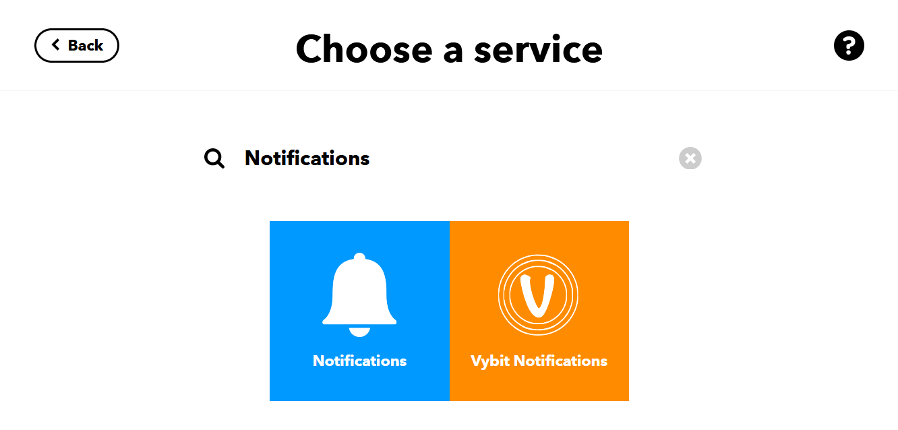
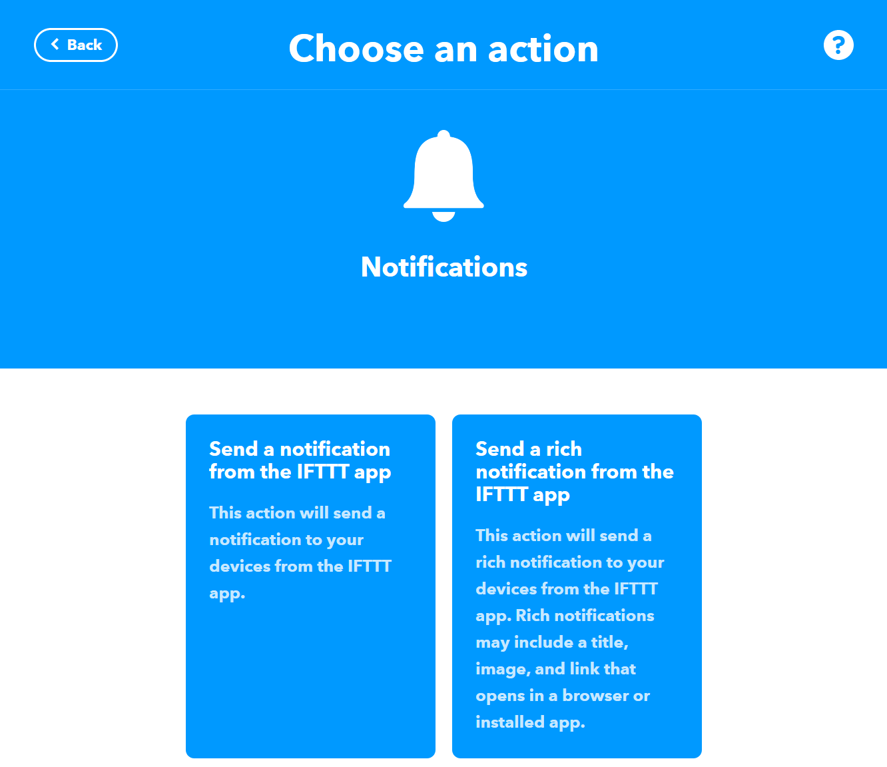
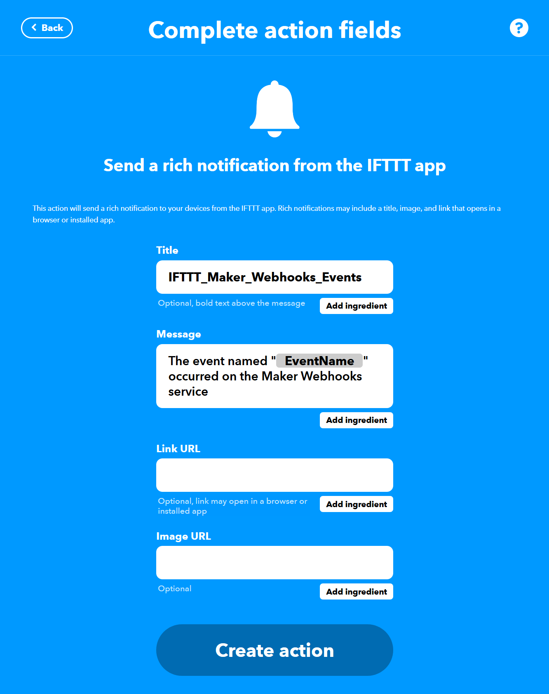
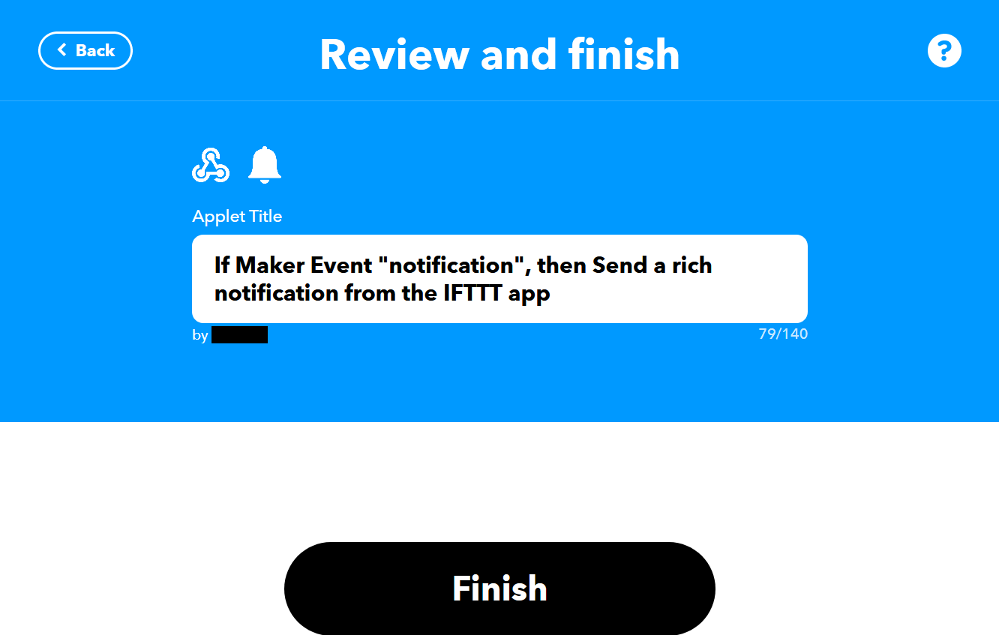

# Help

- [General](#general)
- [Module: Location History](#locationhistory)
- [Module: Finances](#finances)
- [Module: Cars](#cars)
- [Module: Boards](#boards)
- [Module: Crawlers](#crawlers)
- [Module: Splitted Bills](#splittedbills)
- [Module: Trips](#trips)
- [Module: Timesheets](#timesheets)
- [Module: Workouts](#workouts)
- [Module: Recipes](#recipes)
- [Special Admin Functions](#admin)


## <a name="general"></a>General

Login is done with your username and password. The "Code" is for two-factor authentication and only needs to be provided if it has been activated.

<a href="../public/static/help/en/1_login.jpg"></a>


### Home Page

After logging in, the default home page is displayed. The home page can be customized with widgets.  
To do this, click your username in the menu and then select "Home". 

On this page different widgets can be added. If a widget requires additional input, it must be entered in the corresponding window.

Widgets can be moved by clicking on the title and dragging. Settings can be adjusted or the widget removed via the icons.


<a href="../public/static/help/en/2_frontpage.jpg"></a>


<a href="../public/static/help/en/2_frontpage-1.jpg"></a>


<a href="../public/static/help/en/2_frontpage-2.jpg"></a>


<a href="../public/static/help/en/2_frontpage-3.jpg"></a>


### Profile

By clicking your username, you can edit your profile and assign different modules.

In the menu are additional menu entries available to: change your password, set a profile picture, enable two-factor authentication, view logged-in clients (login tokens), and see your activity history.

<a href="../public/static/help/en/2_profile.jpg"></a>


<a href="../public/static/help/en/2_password.jpg"></a>


<a href="../public/static/help/en/2_profilepic.jpg"></a>


<a href="../public/static/help/en/2_twofactor.jpg"></a>


<a href="../public/static/help/en/2_logintokens.jpg"></a>


<a href="../public/static/help/en/2_activities.jpg"></a>


### Application Passwords

Application passwords are required to allow apps to access specific functions automatically.

These functions include:

- Recording location history  
- Transferring crawler data  
- Triggering notifications for specific categories  

Application passwords must be created individually, and login must then be done using the username and the application password.

<a href="../public/static/help/en/2_applicationpasswords.jpg"></a>


<a href="../public/static/help/en/2_applicationpasswords-1.jpg"></a>


### Web App

The application can be installed as a Progressive Web App (PWA) on supported devices.

For example, in Chrome on Android, this can be done via the menu under "Install App" or through the banner "Add App to Home Screen."

<a href="../public/static/help/101_PWA-1.jpg"></a>


Through the profile settings (Start URL), you can specify which subpage should open when launching the Progressive Web App. This allows you to set a frequently used page as the start page.

The page must be specified without the domain name, for example `/finances` for the overview page of the finances module.

### Mobile Favorites

In addition to the Start URL, mobile favorites can be set.

In the mobile view, the icons in the navigation bar can be customized individually.

The order is determined by the numerical position. The icon must correspond to the name of a Fontawesome icon (<https://fontawesome.com/icons?d=gallery&m=free>). The URL should be specified relative to the domain, similar to the Start URL.

The example clock icon (`fas fa-clock`) can be found [here](https://fontawesome.com/icons/clock?style=solid).


<a href="../public/static/help/en/2_mobilefavorites.jpg"></a>

<a href="../public/static/help/en/2_mobilefavorites-1.jpg"></a>

<a href="../public/static/help/en/2_mobilefavorites-3.jpg"></a>

### Notifications

It is possible to receive email notifications for various events. Additionally, notifications can be subscribed to for different actions within the site and for individual notification categories.

All events can be subscribed to as notifications within the website and/or as push notifications.

Internal notifications can be accessed via the bell icon in the menu and are automatically marked as read once the page is opened.

Push notifications must be supported by the browser being used and can then be subscribed to directly.


<a href="../public/static/help/en/2_notifications.jpg"></a>


<a href="../public/static/help/en/2_notifications-1.jpg"></a>


<a href="../public/static/help/en/2_notifications-2.jpg"></a>


If a device does not support web push notifications (e.g., iOS), the IFTTT app can be used as an alternative for notifications.

To do this, an IFTTT account must be created and the IFTTT app installed on the device. Then, the "Webhooks" service must be activated and a new applet created.

The webhook URL for the created applet must then be entered into the corresponding field on the website.


<a href="../public/static/help/100_IFTTT-1.png"></a>


<a href="../public/static/help/100_IFTTT-2.png"></a>


<a href="../public/static/help/100_IFTTT-3.png"></a>


<a href="../public/static/help/100_IFTTT-4.png"></a>


<a href="../public/static/help/100_IFTTT-5.png"></a>


<a href="../public/static/help/100_IFTTT-6.png"></a>


<a href="../public/static/help/100_IFTTT-7.png"></a>


<a href="../public/static/help/100_IFTTT-8.png"></a>


<a href="../public/static/help/100_IFTTT-9.png"></a>

<a href="../public/static/help/100_IFTTT-10.png"></a>

<a href="../public/static/help/100_IFTTT-11.png"></a>

<a href="../public/static/help/100_IFTTT-12.png"></a>

<a href="../public/static/help/100_IFTTT-13.png"></a>

<a href="../public/static/help/100_IFTTT-14.png"></a>

<a href="../public/static/help/100_IFTTT-15.png"></a>

<a href="../public/static/help/100_IFTTT-16.png"></a>

<a href="../public/static/help/en/2_notifications-3.jpg"></a>

<a href="../public/static/help/en/2_notifications-4.jpg"></a>

## <a name="locationhistory"></a>Module: Location History

The Location History module allows all recorded locations to be displayed. Locations can be filtered by date.  
Additionally, various filters (on the right-hand side) can be applied:

  - Show locations clustered
  - Show general locations
  - Show locations related to finance entries
  - Show locations related to cars
  - Connect general locations with lines based on the date

<a href="../public/static/help/en/3_location_history.jpg"></a>

<a href="../public/static/help/en/3_location_history-2.jpg"></a>

<a href="../public/static/help/en/3_location_history-3.jpg"></a>

### Add Locations

It is possible to record general locations either manually or automatically.

#### Add Manually

To add a location manually, select "Add Location" in the menu. Then the location can be specified.

<a href="../public/static/help/en/3_location_history-4.jpg"></a>

<a href="../public/static/help/en/3_location_history-1.jpg"></a>

#### Add Automatically

It is possible to regularly transmit various data to the web application automatically.

At a minimum, the location must be transmitted as a comma-separated list with latitude and longitude as the value `gps_loc`:

``` 
curl --request POST \
  --data 'gps_loc=10,20' \
  http://<user>:<password>@<domain>/api/location/record
            
```

Using the Android app "Tasker," location data and step counts can be automatically transmitted to the web application on a regular basis.  
For example, the following profiles can be used:

#### Counting Steps

``` 
Profil: Schritte (14)
        Ereignis: Ausgeführte Schritte [ Nummer:1 ]
    Eingang: Schritte (23)
        A1: Variable Setzen [ Name:%STEPS Zu:%evtprm1 Recurse Variables:Aus Mathematisch:Aus Hinzufügen:Aus Max Rounding Digits:3 ]
            
```

#### Resetting Steps

``` 
Profil: Schritte zurücksetzen (21)
        Variables: [  ]
        Zeit: 00:00
    Eingang: Schritte Reset (22)
        A1: Profil Status [ Name:Schritte setzen:Aus ] 
        A2: Profil Status [ Name:Schritte setzen:An ] 
        A3: Variable Setzen [ Name:%STEPS Zu:0 Recurse Variables:Aus Mathematisch:Aus Hinzufügen:Aus Max Rounding Digits:3 ]
            
```

#### Capturing Location

``` 
    Profil: Standort erfassen (2)
        Zeit:  Jede 30m
    Eingang: Standort senden 2 (19)
        A1: If [ %TIMES > %LASTLOC+600 ]
        A2: Get Location v2 [  Timeout (Sekunden):20 Minimum Accuracy (meters): Speed (meters/second): Altitude (meters): Near Location: Enable Location If Needed:Aus Last Location If Timeout:Aus Min Speed Accuracy (m/s): ] 
        A3: HTTP Auth [  Method:Username and Password Client ID: Client Secret: Endpoint To Get Code: Endpoint To Get Refresh Token: Scopes: Force Re-Authentication:Aus Timeout (Sekunden):30 Username:my-username Password:my-application-password ] 
        A4: HTTP Request [  Method:POST URL:my-url/api/location/record Headers:%http_auth_headers Query Parameters: Body:{
    "identifier":"my-device", 
    "device":"%DEVID",
    "date":"%DATE",
    "time":"%TIME",
    "batt":"%BATT",
    "times":"%TIMES",
    "wifi_state":"%WIFI",
    "gps_state":"%GPS",
    "mfield":"%MFIELD",
    "screen_state":"%SCREEN",
    "ups":"%UPS",
    "gps_loc":"%gl_coordinates",
    "gps_acc":"%gl_coordinates_accuracy",
    "gps_alt":"%gl_altitude",
    "gps_alt_acc":"%gl_altitude_accuracy",
    "gps_spd":"%gl_speed",
    "gps_spd_acc":"%gl_speed_accuracy",
    "gps_bearing":"%gl_bearing",
    "gps_bearing_acc":"%gl_bearing_accuracy", 
    "gps_tms":"%gl_time_seconds",
    "cell_id":"%CELLID",
    "cell_sig":"%CELLSIG",
    "cell_srv":"%CELLSRV", 
    "steps":"%STEPS" 
    } File To Send: File/Directory To Save With Output: Timeout (Sekunden):10 Trust Any Certificate:Aus Automatically Follow Redirects:Aus Use Cookies:Aus ] 
        A5: If [ %http_response_code = 200 ]
        A6: Variable Setzen [ Name:%LASTLOC Zu:%TIMES Recurse Variables:Aus Mathematisch:Aus Hinzufügen:Aus Max Rounding Digits:3 ] 
        A7: Else 
        A8: Benachrichtigung [ Titel:Response %http_response_code Text:%http_data Icon:null Nummer:0 Dauerhaft:Aus Priorität:3 Repeat Alert:Aus LED Colour:Lila LED Rate:0 Sound Datei: Vibration Pattern: Category:test ] 
            
```

### Steps Statistics

When steps are automatically transmitted, a statistics overview can be displayed. It is also possible to manually adjust the number of steps per day.

<a href="../public/static/help/en/3_location_history-5.jpg"></a>

<a href="../public/static/help/en/3_location_history-6.jpg"></a>

<a href="../public/static/help/en/3_location_history-7.jpg"></a>

<a href="../public/static/help/en/3_location_history-8.jpg"></a>

## <a name="finances"></a>Module: Finances

The finance Module allows you to manage income and expenses. It is possible to record both income and expenses.

<a href="../public/static/help/en/4_finances.jpg"></a>

<a href="../public/static/help/en/4_finances-1.jpg"></a>

<a href="../public/static/help/en/4_finances-2.jpg"></a>

### Manage Categories and Categorize Income/Expenses

A finance entry can be assigned to a category. The available categories can be customized individually.

The default category is automatically preselected when creating a new finance entry.

<a href="../public/static/help/en/4_finances-3.jpg"></a>

<a href="../public/static/help/en/4_finances-4.jpg"></a>

### Automatically Assign Categories Based on Name

Categories can also be automatically assigned to a finance entry based on its name and amount.

Various rules can be defined to determine when a specific category should be assigned to a finance entry.

<a href="../public/static/help/en/4_finances-5.jpg"></a>

<a href="../public/static/help/en/4_finances-6.jpg"></a>

### Automatically Record Recurring Income and Expenses

Recurring income or expenses can be automatically created.

To do this, the finance entries, start/end dates, and intervals (every X days/weeks/months/years) must be defined.

Every day at 6:00, the due finance entries are automatically added.

<a href="../public/static/help/en/4_finances-7.jpg"></a>

<a href="../public/static/help/en/4_finances-8.jpg"></a>

### Manage paymethods

Individual finance entries can be assigned paymethods.

The default paymethod is automatically preselected when creating a finance entry.

Additionally, "round up savings" can be activated. In this case, the amount entered with this paymethod is rounded up to the next 1€/5€, and the difference is credited as a balance to the assigned account.

<a href="../public/static/help/en/4_finances-9.jpg"></a>

<a href="../public/static/help/en/4_finances-10.jpg"></a>

### Manage Accounts

Paymethods are assigned to accounts. When creating a finance entry, a corresponding transaction is automatically posted to the account associated with the selected paymethod.

<a href="../public/static/help/en/4_finances-25.jpg"></a>

<a href="../public/static/help/en/4_finances-31.jpg"></a>

<a href="../public/static/help/en/4_finances-26.jpg"></a>

<a href="../public/static/help/en/4_finances-32.jpg"></a>

<a href="../public/static/help/en/4_finances-33.jpg"></a>

<a href="../public/static/help/en/4_finances-27.jpg"></a>

It is also possible to set up recurring transactions

<a href="../public/static/help/en/4_finances-28.jpg"></a>

<a href="../public/static/help/en/4_finances-29.jpg"></a>

<a href="../public/static/help/en/4_finances-30.jpg"></a>

### Manage Monthly Budget

A monthly budget can be set for different categories.

To do this, a description and the associated categories must be selected. All expenses in other categories are assigned to the "remaining" budget (name can be changed).

Individual budget entries can also be hidden from the overall overview.

The monthly budget and the current status within the month can then be displayed in the overview.  
The budget is always shown when creating or updating a finance entry.

The current budget is always calculated temporarily and is therefore only available for the current month.


<a href="../public/static/help/en/4_finances-11.jpg"></a>

<a href="../public/static/help/en/4_finances-12.jpg"></a>

<a href="../public/static/help/en/4_finances-13.jpg"></a>

<a href="../public/static/help/en/4_finances-14.jpg"></a>

### Various Statistics

In the finance module, different statistics can be accessed.

An overall overview of finances for all years can be viewed directly.  
By clicking on the chart icon, details of the finance entries for a specific year can be displayed.

<a href="../public/static/help/en/4_finances-15.jpg"></a>

<a href="../public/static/help/en/4_finances-20.jpg"></a>

Within a year, clicking on the value of the income or expenses for a specific month will display a detailed overview for that month.

<a href="../public/static/help/en/4_finances-21.jpg"></a>

<a href="../public/static/help/en/4_finances-23.jpg"></a>

Within the income or expenses of a month, an overview of the finance entries for each category can be displayed by clicking the chart icon.

<a href="../public/static/help/en/4_finances-22.jpg"></a>

<a href="../public/static/help/en/4_finances-24.jpg"></a>

The overview of income and expenses for a year can be displayed in the yearly overview by clicking on the income or expense value of that year.

<a href="../public/static/help/en/4_finances-16.jpg"></a>

<a href="../public/static/help/en/4_finances-18.jpg"></a>

The overview of the categories of finance entries for a year can be displayed by clicking on the chart icon.

<a href="../public/static/help/en/4_finances-17.jpg"></a>

<a href="../public/static/help/en/4_finances-19.jpg"></a>

### Monthly Statistics via Email

It is possible to receive a monthly statistic of the finance entries (income and expenses) from the previous month. This email is sent automatically on the 1st of each month at 8:00.

<a href="../public/static/help/100_finances-25.png"></a>

## <a name="cars"></a>Module: Cars

In the Cars module, refills and service can be recorded, and various statistics can be displayed.

<a href="../public/static/help/en/5_cars.jpg"></a>

### Manage Cars

Available cars can be individually defined and shared with other users, allowing multiple users to record data for the same car.

For mileage calculation, you can set the possible kilometers per year, the duration, the start date for calculating the currently available kilometers, and the starting odometer reading.

<a href="../public/static/help/en/5_cars-1.jpg"></a>

<a href="../public/static/help/en/5_cars-2.jpg"></a>

### Record Refill and Calculate Fuel Consumption

After refueling, the data can be recorded. If "Calculate fuel consumption" is selected, the fuel consumption since the last full tank will be calculated automatically.

<a href="../public/static/help/en/5_cars-3.jpg"></a>

<a href="../public/static/help/en/5_cars-5.jpg"></a>

### Record Service

Services can also be recorded for documentation purposes. This includes tracking the oil level, windshield washer fluid, and tire pressure. Additionally, it can be documented whether a repair shop visit or a tire change has taken place.

<a href="../public/static/help/en/5_cars-4.jpg"></a>

<a href="../public/static/help/en/5_cars-6.jpg"></a>

### Fuel Consumption Statistics and Mileage

The fuel consumption trend can be displayed graphically.

Additionally, the mileage for leased or financed cars can be shown.  
Based on the last recorded odometer reading (refill or service), the start date of the lease/finance period, the duration in years, and the starting mileage, the current maximum allowable mileage is calculated and displayed.

<a href="../public/static/help/en/5_cars-7.jpg"></a>

## <a name="boards"></a>Module: Boards

The Boards module allows tasks to be managed using the "Kanban" method.

Multiple users can be invited to boards.

Within a board, stacks with cards can be created. Individual cards can be assigned labels and users. Additionally, due dates and descriptions can be added.

Cards and stacks can be deleted or archived.

<a href="../public/static/help/en/6_boards.jpg"></a>

<a href="../public/static/help/en/6_boards-1.jpg"></a>

<a href="../public/static/help/en/6_boards-2.jpg"></a>

## <a name="boards"></a>Module: Crawlers

The Crawlers module allows you to create and populate your own lists automatically. This can be used, for example, to automatically retrieve information from websites (crawling).

The displayed data can be filtered by retrieval date. Additionally, it can be set to show only new data (based on the retrieval date) or all information (based on both the retrieval and update dates).

<a href="../public/static/help/en/7_crawlers-7.jpg"></a>

By clicking on the star, entries can be added to the watchlist. The watchlist stores all marked entries.

<a href="../public/static/help/en/7_crawlers-8.jpg"></a>

### Manage Crawlers

To display information as lists, a crawler must be created. A default filter can be set during this process.

<a href="../public/static/help/en/7_crawlers.jpg"></a>

<a href="../public/static/help/en/7_crawlers-1.jpg"></a>

### Add a Record

A new record can be added via the web API as follows:

``` 
curl --header "Content-Type: application/json" \
  --request POST \
  --data '{"crawler": "<hash>", "identifier":"offer1", "data":{"name":"job offer 1", "company":"company 2", "pay":50000, "url":"http://www.google.com"}}' \
  http://<user>:<password>@<domain>/api/crawlers/record
            
```

You need to provide the crawler's hash, a unique identifier for the record to determine whether it is a new record or an update, and the data fields. The data can contain multiple fields (in this example: name, company, pay, and url).

### Crawler Headers/Columns

The individual columns of a table can be set for each crawler. You need to define the header text and which data field of a record should be displayed in the column (field name). Additionally, a data field can be set for linking. This is useful, for example, in the example above: the field `name` can be set as the field name and the field `url` as the link field.

It is also possible to set static content via field content.

The position specifies the column's position within the table, and the "sortable" option defines whether the column can be sorted. The data type of the column can be set for sorting purposes.

Within a crawler, it is also possible to define the initial sorting (ascending or descending) for at most one column. The table will then be sorted by this column when loaded.

If a column should contain the original value before an update, this can be selected via the corresponding checkbox. In this column, only updated records will display the previous value. For example, two columns for the field `price` can be set to see price changes. Note that only the immediately previous value is stored; changes over a longer period cannot be displayed.

Prefixes and suffixes can be applied using prefix and suffix. For example, the currency can be added after a value.

<a href="../public/static/help/en/7_crawlers-2.jpg"></a>

<a href="../public/static/help/en/7_crawlers-3.jpg"></a>

<a href="../public/static/help/en/7_crawlers-4.jpg"></a>

### Crawler Links

Below the list, links for quick access can also be created. A maximum of two levels can be displayed.

<a href="../public/static/help/en/7_crawlers-5.jpg"></a>

<a href="../public/static/help/en/7_crawlers-5b.jpg"></a>

## <a name="splittedbills"></a>Module: Splitted Bills

In the Splitted Bills module, various expenses that are shared with other users or paid by other users can be recorded.

<a href="../public/static/help/en/8_splittedbills.jpg"></a>

<a href="../public/static/help/en/8_splittedbills-1.jpg"></a>

Within the group, the expenses are then settled.

A splitted bill always has one or more users who have paid something and one or more users who have to bear a share of the costs (spent).

Debts can also be recorded as settled.

<a href="../public/static/help/en/8_splittedbills-2.jpg"></a>

<a href="../public/static/help/en/8_splittedbills-3.jpg"></a>

<a href="../public/static/help/en/8_splittedbills-4.jpg"></a>

It is also possible to create a group for sharing expenses abroad. For this, a foreign currency, an exchange rate, and a fee (in percent) can be specified.

<a href="../public/static/help/en/8_splittedbills-5.jpg"></a>

<a href="../public/static/help/en/8_splittedbills-6.jpg"></a>

<a href="../public/static/help/en/8_splittedbills-7.jpg"></a>

### Recurring Expenses

As with user-specific finance entries, it is also possible to set up recurring expenses for groups with splitted bills.

<a href="../public/static/help/en/8_splittedbills-9.jpg"></a>

<a href="../public/static/help/en/8_splittedbills-10.jpg"></a>

## <a name="trips"></a>Module: Trips

In the Trips module, travel plans can be recorded and displayed on a map.

<a href="../public/static/help/en/9_trips.jpg"></a>

<a href="../public/static/help/en/9_trips-1.jpg"></a>

<a href="../public/static/help/en/9_trips-3.jpg"></a>

<a href="../public/static/help/en/9_trips-4.jpg"></a>

<a href="../public/static/help/en/9_trips-5.jpg"></a>

<a href="../public/static/help/en/9_trips-6.jpg"></a>

## <a name="timesheets"></a>Module: Timesheets

In the Timesheets module, project-specific start and end times can be recorded. A distinction can be made between project-based (start/end) and day-based (clock-in/clock-out) tracking.

<a href="../public/static/help/en/10_timesheets-4.jpg"></a>

<a href="../public/static/help/en/10_timesheets-5.jpg"></a>

Timesheet entries can be marked as calculated, paid, or planned. Additionally, when creating or updating timesheet entries, they can be set up as a series.

<a href="../public/static/help/en/10_timesheets-31.jpg"></a>

<a href="../public/static/help/en/10_timesheets-30.jpg"></a>

### Projects

<a href="../public/static/help/en/10_timesheets.jpg"></a>

<a href="../public/static/help/en/10_timesheets-1.jpg"></a>

### Customers

Timesheet entries can be assigned to individual customers. Customers can be archived, which hides them from the selection list. Additionally, background and text colors can be set for the calendar view.

<a href="../public/static/help/en/10_timesheets-15.jpg"></a>

<a href="../public/static/help/en/10_timesheets-16.jpg"></a>

<a href="../public/static/help/en/10_timesheets-17.jpg"></a>

### Fast Creation of Times

With Fast Creation of Times, the current time can be recorded as start or end with a single click.

If the link to this page is set as the start URL or as a mobile favorite, the start or end time can be recorded very quickly.

<a href="../public/static/help/en/10_timesheets-6.jpg"></a>

### Timesheet Categories

Recorded times can additionally be assigned to categories.

<a href="../public/static/help/en/10_timesheets-2.jpg"></a>

<a href="../public/static/help/en/10_timesheets-3.jpg"></a>

### Project Budgets

Project budgets can be defined for individual projects. Corresponding categories are assigned to each budget. When a new timesheet entry is recorded and the same (or more) categories are assigned, this timesheet entry is added to the budget.

<a href="../public/static/help/en/10_timesheets-8.jpg"></a>

The project budget can be calculated based on the total time, the modified time, or the number of assigned timesheet entries. Multiple budgets can be grouped using the main category. Additionally, three thresholds can be defined for color highlighting (yellow, orange, red).

<a href="../public/static/help/en/10_timesheets-9.jpg"></a>

<a href="../public/static/help/en/10_timesheets-10.jpg"></a>

<a href="../public/static/help/en/10_timesheets-11.jpg"></a>

### Requirements

It is possible to define types of requirements that have a specific validity period.

<a href="../public/static/help/en/10_timesheets-39.jpg"></a>

<a href="../public/static/help/en/10_timesheets-40.jpg"></a>

For customers, it can then be recorded whether the corresponding requirement has been fulfilled within the specified period.

<a href="../public/static/help/en/10_timesheets-42.jpg"></a>

<a href="../public/static/help/en/10_timesheets-41.jpg"></a>

### Reminders

It is possible to define different reminders after each entry, after the last entry of a day, or one hour after the last entry of a day. These can then be subscribed to for internal and push notifications.

<a href="../public/static/help/en/10_timesheets-43.jpg"></a>

<a href="../public/static/help/en/10_timesheets-44.jpg"></a>

### Notices

For timesheet entries, customers, and timesheet projects, end-to-end encrypted (E2EE) notices and files can be stored. These data never leave the device unencrypted and are only received and stored by the server in encrypted form.

<a href="../public/static/help/en/10_timesheets-27.jpg"></a>

<a href="../public/static/help/en/10_timesheets-28.jpg"></a>

To use notices, a password must first be set for the timesheet project.

<a href="../public/static/help/en/10_timesheets-18.jpg"></a>

The password can also be changed later.

<a href="../public/static/help/en/10_timesheets-19.jpg"></a>

If the password is forgotten, the recovery key can be used to reset the password.

<a href="../public/static/help/en/10_timesheets-25.jpg"></a>

<a href="../public/static/help/en/10_timesheets-32.jpg"></a>

If both the password is forgotten and the recovery key has not been saved, no data can be recovered!

Before notices can be added or accessed, the password must be entered. This password is temporarily stored in the browser.

<a href="../public/static/help/en/10_timesheets-20.jpg"></a>

Notices can be entered either in a generic text field or in individually configurable fields.

The freely configurable fields can be set as a text field, text area, dropdown, or HTML.

<a href="../public/static/help/en/10_timesheets-12.jpg"></a>

<a href="../public/static/help/en/10_timesheets-13.jpg"></a>

<a href="../public/static/help/en/10_timesheets-14.jpg"></a>

Notices can then be saved for timesheet entries and customers.

<a href="../public/static/help/en/10_timesheets-21.jpg"></a>

<a href="../public/static/help/en/10_timesheets-22.jpg"></a>

<a href="../public/static/help/en/10_timesheets-24.jpg"></a>

For projects, currently only the special "legend" field of the project is displayed in the calendar view.

<a href="../public/static/help/en/10_timesheets-23.jpg"></a>

<a href="../public/static/help/en/10_timesheets-26.jpg"></a>

### Calendar View

In the calendar view, events can be displayed in a month, week, or day view, or as a list. The main hours and hideable weekdays (week and day view only) can be set per project.

Clicking on the calendar allows a new event to be created. Clicking on an event opens a dialog with details. This includes a link to the notice of the customer and the timesheet entry, as well as options to edit the entry. An entry can be deleted directly, or for entries that are part of a series, this and subsequent entries can be deleted.

If background and text colors have been set for a customer, the entries are colored accordingly. Additionally, the encrypted legend is displayed below the calendar.

The last viewed view and date are saved for the next visit.

<a href="../public/static/help/en/10_timesheets-29.jpg"></a>

### Export

The recorded hours and notices can be exported in various formats.

Exporting to Excel provides an overview of the individual hours within the selected time period.

<a href="../public/static/help/en/10_timesheets-33.jpg"></a>

<a href="../public/static/help/100_timesheets-7.png"></a>

The HTML export allows viewing and exporting timesheet entries including encrypted notices. The notices can be exported to Word after decryption.

<a href="../public/static/help/en/10_timesheets-34.jpg"></a>

<a href="../public/static/help/en/10_timesheets-35.jpg"></a>

The customer overview provides a tabular view of all customers, including selected encrypted notices. This overview can be exported to Excel after decryption.

<a href="../public/static/help/en/10_timesheets-36.jpg"></a>

<a href="../public/static/help/en/10_timesheets-37.jpg"></a>

<a href="../public/static/help/en/10_timesheets-38.jpg"></a>

## <a name="workouts"></a>Module: Workouts

In the Workouts module, fitness training sessions can be created and managed.

When creating a training plan, exercises can be selected from the available list. The list can be searched and filtered by body area. The number of sets to be performed can be set at the bottom. By clicking the plus icon, the exercise is added to the training plan. Here, a notice and the number of sets can be specified.

Exercises can be removed from the training plan using the minus icon and reordered using the cross icon.

Additionally, training days and supersets can be defined.

<a href="../public/static/help/en/11_workouts.jpg"></a>

<a href="../public/static/help/en/11_workouts-1.jpg"></a>

<a href="../public/static/help/en/11_workouts-18.jpg"></a>

<a href="../public/static/help/en/11_workouts-14.jpg"></a>

By clicking on a training plan in the overview list, it can be viewed.

<a href="../public/static/help/en/11_workouts-2.jpg"></a>

### View Exercises

All available exercises can be viewed in the menu under "Exercises".

<a href="../public/static/help/en/11_workouts-15.jpg"></a>

### Record Session

After selecting a workout plan, the sessions can be viewed and recorded.

If training days have been set in a workout plan, a day must be selected first. Then all exercises from the workout plan are displayed.

Individual exercises can be removed and rearranged. It is also possible to manually add exercises. For each exercise, the sets can be edited and a notice can be added.

<a href="../public/static/help/en/11_workouts-16.jpg"></a>

<a href="../public/static/help/en/11_workouts-26.jpg"></a>

<a href="../public/static/help/en/11_workouts-17.jpg"></a>

<a href="../public/static/help/en/11_workouts-19.jpg"></a>

<a href="../public/static/help/en/11_workouts-21.jpg"></a>

During training, a workout session can be recorded interactively:

<a href="../public/static/help/en/11_workouts-22.jpg"></a>

### Apply Templates

Under workout templates, predefined templates set by the administrator can be viewed and adopted as your own workout

<a href="../public/static/help/en/11_workouts-3.jpg"></a>

<a href="../public/static/help/en/11_workouts-23.jpg"></a>

### Workout Statistics

Workout statistics can be displayed for the current plan or for all plans.

<a href="../public/static/help/en/11_workouts-25.jpg"></a>

<a href="../public/static/help/en/11_workouts-24.jpg"></a>

### Administrator Functions

As an administrator, it is possible to modify and add various data.

#### Manage Exercises

<a href="../public/static/help/en/11_workouts-6.jpg"></a>

<a href="../public/static/help/en/11_workouts-7.jpg"></a>

#### Manage Templates

<a href="../public/static/help/en/11_workouts-3.jpg"></a>

<a href="../public/static/help/en/11_workouts-4.jpg"></a>

#### Manage Muscle Groups

It is possible to manage individual muscle groups and their images. There is a main image and, for each muscle, a primary and secondary image that can be overlaid on the main image (transparency).

<a href="../public/static/help/en/11_workouts-8.jpg"></a>

<a href="../public/static/help/en/11_workouts-10.jpg"></a>

<a href="../public/static/help/en/11_workouts-9.jpg"></a>

#### Manage Bodyparts

<a href="../public/static/help/en/11_workouts-11.jpg"></a>

<a href="../public/static/help/en/11_workouts-12.jpg"></a>

## <a name="recipes"></a>Module: Recipes

In the Recipes module, recipes can be recorded and added to cookbooks or meal plans.

<a href="../public/static/help/en/12_recipes-1.jpg"></a>

<a href="../public/static/help/en/12_recipes-2.jpg"></a>

### Manage Ingredients

For the individual steps in recipes, ingredients can be assigned. These must be created first.

<a href="../public/static/help/en/12_recipes-9.jpg"></a>

<a href="../public/static/help/en/12_recipes-10.jpg"></a>

### Create/Edit Recipe

When creating or editing a recipe, individual steps must be created. Descriptions and ingredients can then be added to each step.

<a href="../public/static/help/en/12_recipes-3.jpg"></a>

### Cookbooks

Cookbooks can be created as a collection of recipes. They can also be shared with other users.

<a href="../public/static/help/en/12_recipes-5.jpg"></a>

<a href="../public/static/help/en/12_recipes-6.jpg"></a>

<a href="../public/static/help/en/12_recipes-7.jpg"></a>

In the recipe view, a recipe can be added to a cookbook.

<a href="../public/static/help/en/12_recipes-2.jpg"></a>

<a href="../public/static/help/en/12_recipes-4.jpg"></a>

If a recipe is accessed from the cookbook, it can be removed from the cookbook again.

<a href="../public/static/help/en/12_recipes-8.jpg"></a>

### Mealplans

It is possible to assign recipes and notices as a meal plan for individual weekdays.

<a href="../public/static/help/en/12_recipes-11.jpg"></a>

<a href="../public/static/help/en/12_recipes-12.jpg"></a>

<a href="../public/static/help/en/12_recipes-13.jpg"></a>

<a href="../public/static/help/en/12_recipes-14.jpg"></a>

### Shopping Lists

Shopping lists can be used to record necessary ingredients, groceries, or other required purchases.

<a href="../public/static/help/en/12_recipes-15.jpg"></a>

<a href="../public/static/help/en/12_recipes-16.jpg"></a>

<a href="../public/static/help/en/12_recipes-17.jpg"></a>

<a href="../public/static/help/en/12_recipes-18.jpg"></a>

## <a name="admin"></a>Special Admin Functions

As an administrator, various additional functions within the web application can be viewed and managed.

  - Overview of all stored logins
  - Overview of blocked IP addresses (after three failed login attempts)
  - Manage users
  - Test push notifications

<a href="../public/static/help/en/2_settings.jpg"></a>  

<a href="../public/static/help/en/2_logintokens-1.jpg"></a>

<a href="../public/static/help/en/2_banlist.jpg"></a>

<a href="../public/static/help/en/2_users.jpg"></a>

<a href="../public/static/help/en/2_notifications-5.jpg"></a>

<a href="../public/static/help/en/2_notifications-6.jpg"></a>

### Set Custom Notification Categories

It is possible to define user-specific custom notification categories.

<a href="../public/static/help/en/2_notifications-7.jpg"></a>

<a href="../public/static/help/en/2_notifications-8.jpg"></a>

Notifications can be automatically sent to users who have subscribed to the corresponding category using the following call.

``` 
curl "http://<user>:<password>@<domain>/api/notifications/notify?type=test_notification_cat&title=Test%20title&message=Test%20message"
```
